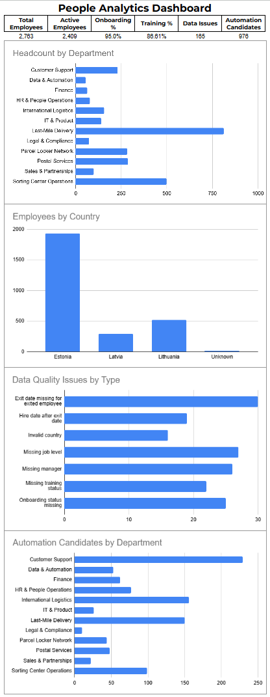

# People Analytics Dashboard

This is a small portfolio project focused on people analytics, HR data quality, KPI reporting, and automation opportunities.

I built this project to practice working with a larger HR-style dataset and to show how raw employee data can be turned into a clear dashboard for business users. The project is especially focused on practical reporting questions, data quality issues, and areas where automation could reduce manual work.

## Project Overview

The project uses a fully synthetic employee dataset with 2,763 records. The dataset is inspired by the structure of a large logistics company, but it does not contain any real employee data.

The dashboard helps answer questions such as:

- How many employees are active?
- How is the workforce distributed by department and country?
- Are onboarding and training processes being completed?
- What data quality issues exist in the dataset?
- Which departments could benefit most from automation?

The goal was not just to create charts, but to build a small, realistic reporting workflow that connects data, quality checks, and business decisions.

## Dashboard Preview



## Key Metrics

| Metric | Value |
|---|---:|
| Total employees | 2,763 |
| Active employees | 2,409 |
| Onboarding completion rate | 95.0% |
| Training completion rate | 86.6% |
| Data quality issues | 165 |
| Automation candidate records | 976 |

## Tools Used

- Google Sheets
- CSV data
- Pivot tables
- Dashboard charts
- Data quality checks
- KPI documentation

## What This Project Demonstrates

This project demonstrates several practical skills that are useful in people operations, data analysis, QA, support, and automation-related roles:

- Working with structured employee data
- Creating pivot tables and summary views
- Defining and tracking HR-related KPIs
- Building a simple business dashboard
- Identifying data quality problems
- Thinking about reporting risks
- Finding areas where automation could reduce manual work
- Documenting findings clearly for non-technical users

## Dataset

The dataset is synthetic and contains 2,763 employee records.

It includes fields such as:

- employee ID
- department
- country
- job level
- hire date
- exit date
- employee status
- onboarding status
- training status
- engagement score
- absenteeism days
- overtime hours
- automation candidate status
- data quality issue type

Some data quality issues were intentionally included in the dataset. This was done to make the project more realistic and to demonstrate validation thinking.

## Dashboard Sections

The dashboard includes four main sections:

### 1. Workforce Overview

Shows the number of employees by department. This helps understand where the largest teams are and how the organization is structured.

### 2. Employees by Country

Shows employee distribution by country. The chart also includes `Unknown` values, which are intentionally included as a data quality signal.

### 3. Data Quality Issues

Shows the most common data quality issues in the dataset. This is important because poor data quality can affect reporting, workforce planning, onboarding tracking, and management decisions.

### 4. Automation Candidates

Shows which departments have the highest number of automation candidate records. This can help prioritize where manual checks, reminders, or reporting workflows could be automated.

## Data Quality Findings

The dataset contains 165 data quality issues.

Examples of issues found:

| Issue type | Why it matters |
|---|---|
| Missing exit date for exited employee | Can make turnover reporting inaccurate |
| Missing job level | Makes workforce structure analysis incomplete |
| Missing manager | Makes reporting lines unclear |
| Missing training status | Makes training coverage reporting unreliable |
| Missing onboarding status | Makes onboarding tracking unreliable |
| Invalid country | Can distort country-level reporting |
| Hire date after exit date | Indicates invalid employee lifecycle data |

I treated these issues as part of the analysis instead of simply hiding them. In a real business context, these kinds of problems would need to be fixed before monthly reporting or management decisions.

## Automation Opportunities

The project also looks at where automation could improve HR reporting and data quality.

Possible automation ideas include:

- Flagging exited employees without exit dates
- Detecting missing manager or job level fields
- Sending reminders for incomplete onboarding
- Sending reminders for missing training status
- Validating country values against an approved list
- Creating a monthly data quality summary
- Refreshing people analytics reports automatically

The biggest value would likely come from a recurring data quality check that runs before monthly HR reporting.

## Files in This Repository

```text
people-analytics-dashboard/
- data/
    - employee_data.csv
- docs/
    - KPI_DEFINITIONS.md
    - DATA_QUALITY_REPORT.md
    - AUTOMATION_IDEAS.md
- screenshots/
    - dashboard.png
- README.md
```
## What I learned

While building this project, I practiced how to move from raw data to a more useful business view.

The most valuable part was not only building the dashboard, but also thinking about the quality of the data behind it. If the data contains missing fields, invalid values, or lifecycle errors, the dashboard can give misleading results.

This project helped me practice:
    - preparing a structured dataset
    - creating useful KPI summaries
    - building pivot-based dashboard views
    - spotting data quality risks
    - explaining findings in a business-friendly way
    - connecting data analysis with automation opportunities

## Why This Project Matters

Many business and HR teams work with data that is spread across spreadsheets, HR systems, ticketing tools, or manual reports. Even a simple dashboard can become useful if the data is structured well and the reporting logic is clear.

This project shows how I approach that kind of work: start with the data, check its quality, define useful metrics, build a clear dashboard, and suggest practical improvements.